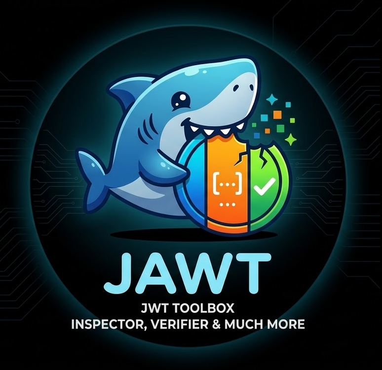

# JAWT 🛠️

<p align="center">
  
</p>

A security-first JWT CLI for developers and platform engineers for inspecting and verifying JSON Web Tokens (JWT). Built with Go for speed, reliability, and ease of use in both manual workflows and automated pipelines.

[](https://opensource.org/licenses/MIT)
[](https://github.com/alessandrocaglio/jawt)

## 🚀 Key Features

- **Flexible Input (The Resolver Pattern):** Read tokens or keys from direct strings, local files (`@path`), or `stdin` (`-`).
- **Unified Inspection & Verification:** Always decodes and displays token content, with automatic cryptographic validation if a key is provided.
- **Signature Verification:** Supports HMAC (HS256/384/512), RSA (RS256/384/512), ECDSA (ES256/384/512), and EdDSA (Ed25519).
- **JWKS Integration:** Fetch and validate against local or remote JSON Web Key Sets (JWKS).
- **Generic OIDC Integration:** Support any compliant OIDC provider (Google, Auth0, Okta, etc.) with automatic discovery and introspection.
- **Keycloak Preset:** Easily fetch OIDC discovery information or introspect tokens from Keycloak realms.
- **Smart Output:** Default machine-readable **JSON** output, with a beautiful colorized **Table** view for humans.
- **Timestamp Awareness:** Automatically converts `exp`, `iat`, `nbf`, `auth_time`, and `updated_at` claims into human-readable date-time strings.
- **Security Hardened:** Explicitly rejects `none` algorithms and protects against key confusion attacks.

---

## 📥 Installation

```bash
# Clone the repository
git clone https://github.com/alessandrocaglio/jawt.git
cd jawt

# Build the binary
go build -o jawt ./cmd/jawt/main.go

# (Optional) Move to your PATH
sudo mv jawt /usr/local/bin/
```

---

## 🛠 Usage Guide

### 1. Inspecting & Decoding
Parse the header and payload without performing cryptographic verification.
`jawt` defaults to this action if no subcommand is provided.

```bash
# Default action (direct string)
jawt <TOKEN>

# Default action (stdin)
echo <TOKEN> | jawt

# Explicit subcommand
jawt inspect <TOKEN>

# From a file
jawt inspect @path/to/token.jwt

# Human-readable table output
jawt <TOKEN> -o table
```

### 2. Verifying
Cryptographically validate the signature and time-based claims by providing a verification key. 

**Note:** The tool will always display the decoded token content first, even if verification fails. If verification fails, the tool will exit with **Code 2**.

```bash
# Using a symmetric secret
jawt inspect <TOKEN> --secret "my-super-secret"

# Using a Public Key (RSA/ECDSA/EdDSA)
jawt inspect <TOKEN> --pem @public_key.pem

# Using a remote JWKS endpoint
jawt inspect <TOKEN> --jwks https://auth.example.com/.well-known/jwks.json

# Verification also works with the default command
jawt <TOKEN> --secret "my-super-secret"
```

### 3. Creating & Signing
Create a new JWT from scratch. By default, it prints the raw signed token string to `stdout`.
Aliases: `sign`.

```bash
# HMAC (HS256) with custom subject and expiration (1 hour)
jawt create --alg HS256 --secret "my-secret" --sub "user123" --exp 1h

# Using the 'sign' alias
jawt sign --alg HS256 --secret "my-secret" --sub "user123" --exp 1h

# RSA (RS256) with private key and custom claims
jawt create --alg RS256 --pem @private_key.pem --claim role=admin --claim id=456

# Using a JSON file for the payload
jawt create --alg HS256 --secret "my-secret" --payload @claims.json

# Output decoded JSON for immediate inspection
jawt create --alg HS256 --secret "my-secret" --sub "user123" -o json
```

### 4. Key Generation
Generate asymmetric key pairs for JWT signing.

```bash
# Generate RSA-2048 (prints to stdout)
jawt keygen

# Generate ECDSA P-384 and save to files
jawt keygen -a ecdsa -c P384 -f mykey
# Results in 'mykey' (private) and 'mykey.pub' (public)

# Generate EdDSA (Ed25519) and save to files
jawt keygen -a eddsa -f mykey-ed
```

### 5. JWKS Generation
Convert public keys to standardized JSON Web Key Sets (JWKS).

```bash
# Convert a public key to JWKS
jawt jwks @rsa_id.pub --kid my-key-id

# Convert multiple keys to JWKS
jawt jwks @rsa_id.pub @eddsa.pub --kid rsa-key --kid ed-key
```

### 6. OIDC & Keycloak Integration
`jawt` supports generic OpenID Connect (OIDC) providers and includes a special preset for Keycloak.

#### Generic OIDC
Use the `oidc` command for any compliant provider.

```bash
# Fetch and display discovery info (requires --issuer)
jawt oidc info --issuer https://accounts.google.com

# Token Login (client credentials or password)
jawt oidc login --issuer https://auth.example.com --client-id my-id --client-secret my-secret

# Token Introspection
jawt oidc introspect <TOKEN> --issuer https://auth.example.com --client-id my-id --client-secret my-secret
```

#### Keycloak Preset
The `keycloak` (alias `kc`) command remains available as a convenient shortcut for Keycloak realms.

```bash
# Fetch and display discovery info
jawt keycloak info --url https://keycloak.example.com --realm myrealm

# Token Login
jawt keycloak login --url https://keycloak.example.com --realm myrealm --client-id my-client --client-secret my-secret

# Token Introspection
jawt keycloak introspect <TOKEN> --url https://keycloak.example.com --realm myrealm --client-id my-client --client-secret my-secret
```

### 7. Version
Print the version, commit hash, and build date.

```bash
jawt version
```

---

## 📊 Output Formats

Toggle between formats using the `-o` or `--output` flag.

| Format | Command | Description |
| :--- | :--- | :--- |
| **JSON** | `-o json` | **(Default)** Indented JSON, perfect for `jq` or scripting. |
| **Table** | `-o table` | Colorized, human-friendly table with date-time conversions. |
| **OpenID** | `-o openid` | Raw `openid-configuration` JSON from the server (for `oidc info` or `keycloak info`). |

### JSON Schema Extensions
When verification is requested, `jawt` adds an `x-validation` field to the JSON output. This follows the industry convention of using an `x-` prefix for tool-specific metadata, ensuring that the original JWT structure (header, payload, signature) remains untampered and clearly separated from the tool's assessment.

**Example (Failed Verification):**
```json
{
  "header": { ... },
  "payload": { ... },
  "signature": "...",
  "x-validation": {
    "valid": false,
    "status": "INVALID",
    "error": "token is expired by 1h5m20s",
    "algorithm": "RS256"
  }
}
```

---

## 📑 CLI Reference

### Global Flags
- `-o, --output <string>`: Output format. Options: `json` (default), `table`, `openid`.

### `inspect` Flags
- *Usage: `jawt inspect [token|-|@file] [flags]`*
- `--secret <string>`: Symmetric secret for HMAC verification.
- `--pem <path>`: Path to RSA/ECDSA/EdDSA public key file (`@path`).
- `--jwks <uri|path>`: Path or URL to a JWKS.
- `--leeway <duration>`: Clock skew tolerance (e.g., `1m`, `30s`). **Default is `0s`**. Values greater than `5m` will trigger a security warning.
- *Aliases: `decode`, `verify`*

### `keygen` Flags
- `-a, --alg <string>`: Algorithm: `rsa` (default), `ecdsa`, or `eddsa`.
- `-b, --bits <int>`: RSA bit size: `2048`, `3072`, `4096`.
- `-c, --curve <string>`: ECDSA curve: `P256`, `P384`, `P521`.
- `-f, --file <path>`: Save to file (creates `.pub` for public key). **If omitted, prints both private and public keys to stdout.**

### `jwks` Flags
- *Usage: `jawt jwks [key-input]... [flags]`*
- `--kid <string>`: Key ID for each key (repeatable).
- `-o, --output <string>`: Output format (only `json` supported for this command).

### `oidc info` Flags
- `--issuer <string>`: OIDC provider issuer URL.

### `oidc introspect` Flags
- `--issuer <string>`: OIDC provider issuer URL.
- `--client-id <string>`: Client ID.
- `--client-secret <string>`: Client Secret.

### `oidc login` Flags
- `--issuer <string>`: OIDC provider issuer URL.
- `--client-id <string>`: Client ID.
- `--client-secret <string>`: Client Secret.
- `--username <string>`: Username (for password grant).
- `--password <string>`: Password (for password grant).
- `--scope <string>`: Token scope (default: `openid`).

### `keycloak info` Flags
- `--url <string>`: Keycloak base URL.
- `--realm <string>`: Keycloak realm name.

### `keycloak introspect` Flags
- *Usage: `jawt keycloak introspect [token|-|@file] [flags]`*
- `--url <string>`: Keycloak base URL.
- `--realm <string>`: Keycloak realm name.
- `--client-id <string>`: Keycloak Client ID.
- `--client-secret <string>`: Keycloak Client Secret.

### `keycloak login` Flags
- `--url <string>`: Keycloak base URL.
- `--realm <string>`: Keycloak realm name.
- `--client-id <string>`: Keycloak Client ID.
- `--client-secret <string>`: Keycloak Client Secret.
- `--username <string>`: Username (for password grant).
- `--password <string>`: Password (for password grant).
- `--scope <string>`: Token scope (default: `openid`).

### `version`
- *Usage: `jawt version`*
- Prints version, commit hash, and build date.

---

## 🚦 Exit Codes

`jawt` uses standard exit codes for automation reliability:

| Code | Meaning |
| :--- | :--- |
| `0` | **Success**: Token is valid and verified. |
| `1` | **System Error**: File not found, network timeout, or malformed input. |
| `2` | **Validation Error**: Expired token, invalid signature, or algorithm mismatch. |

---

## 🧪 Development & Testing

We maintain a 100% logic coverage goal for core components.

```bash
# Run all unit tests
go test ./...

# Run tests with coverage
go test -cover ./...
```

---
